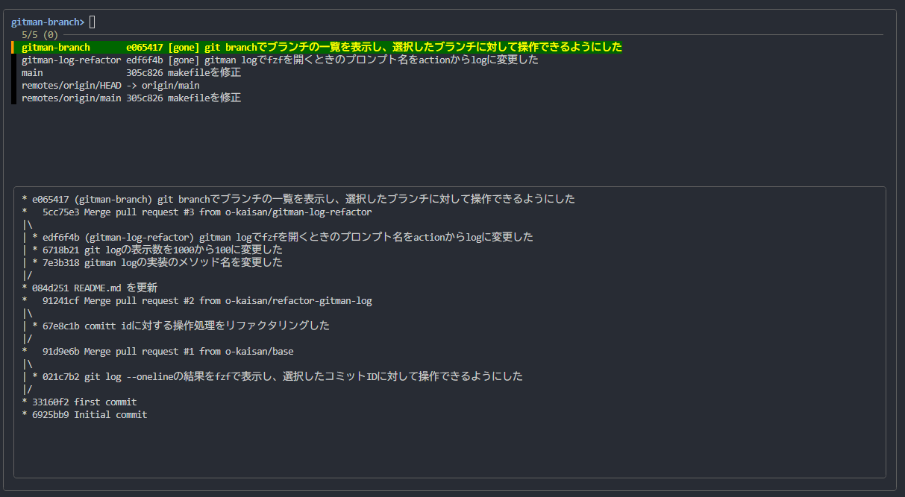
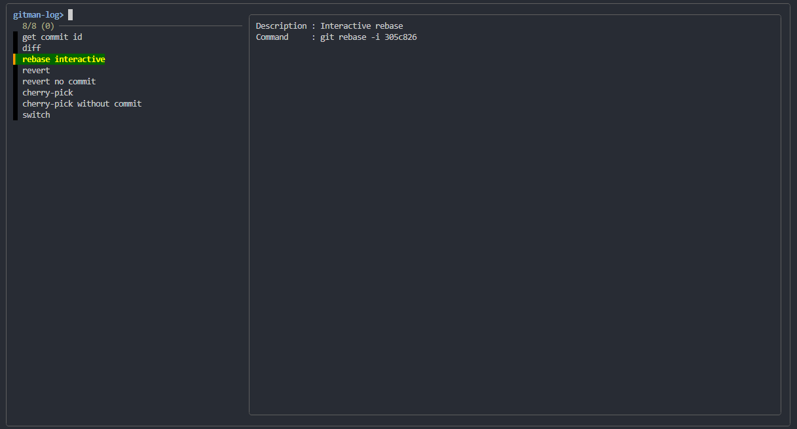
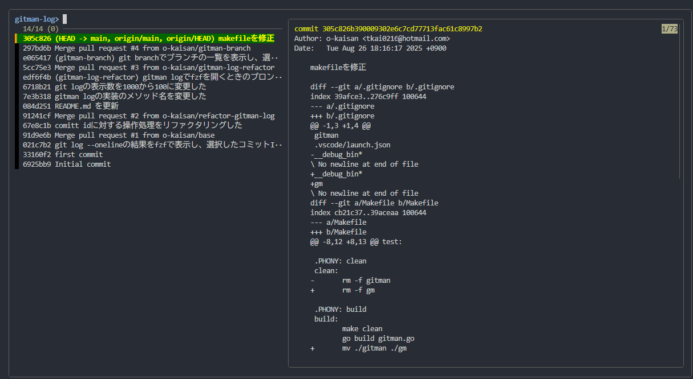

# GitMan (Git Manager)

Your friendly neighbor who’s too lazy to use Git

## What is gitman

gitman is your friendly Git sidekick 🛠️.
A command-line tool that saves you from typing long commands and memorizing commit hashes.
Powered by fzf, it helps you navigate branches, commits, and actions with ease — so you can spend more time coding, and less time wrestling with Git.

## Demo

branch view




log view




## Dependence

| name | version |
| --- | --- |
| golang | >= 1.24.2 |
| fzf | >= 0.65.1 |
| git | >= 1.51.0 |

## Installation

```bash
go install github.com/o-kaisan/gitman@latest
```

## Features

## Environment variable

| value | type | defaut | description |
| -- | -- | -- | -- |
| GITMAN_DEBUG | bool | false | |
| GITMAN_BRANCH_ALIAS | string | br | |
| GITMAN_LOG_ALIAS | string | l | |
